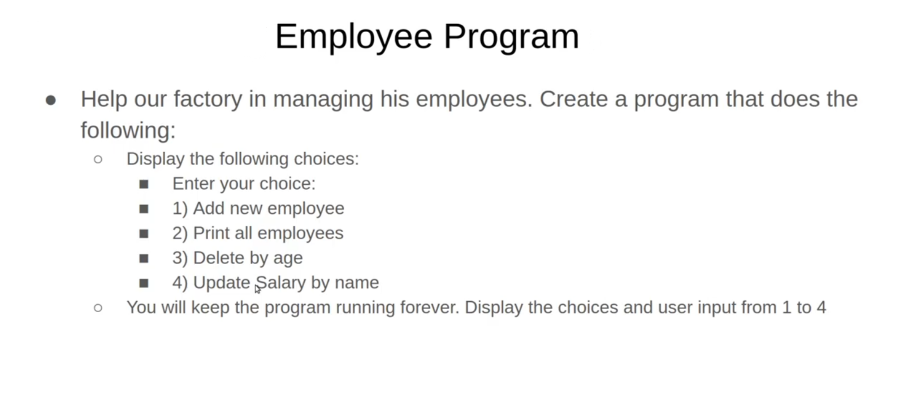

# C++ Consol Project

## **Employee Management System**
>Small & Efficient consol project to manage employees   data :   
(name, age, salary, position)  
 and provide some useful functions for company with  dynamic range of employees data and use vector of tuple if there is any growth come in the future, and still run until you close it, then data will be erased.

  * you can perform some function by choosing different options as follow:
   
    0. close the program and data will be lost
    1. Add new Employee 
    2. Print all employees stored in the array
    3. delete employee by age range
    4. update salary by using employee name
    5. delete employee by name
   
    
****